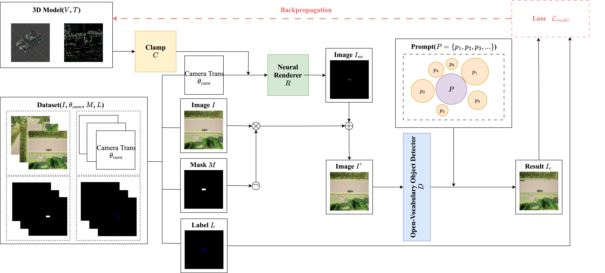

# MPA: A Multi-Prompt Physical Camouflage Attack Framework for Open-Vocabulary Object Detection in Remote Sensing Imagery
## Abstract
Adversarial camouflage has emerged as an effective physical attack strategy against object detectors owing to its robustness across varying viewpoints. However, most existing approaches are designed for closed-set detectors and cannot address the semantic generalization challenges of open-vocabulary models. In this paper, we present the first adversarial camouflage framework targeting open-vocabulary object detectors in remote sensing imagery. The proposed method jointly optimizes adversarial camouflage across multiple semantically related prompt words, mitigating prompt-sensitive overfitting and improving robustness under diverse semantic queries. To ensure physical plausibility and visual concealment, we incorporate a controllable color constraint that enables scene-adaptive camouflage instantiation in natural environments such as forests and grasslands. In addition, we construct and release a new multi-view armored-vehicle remote sensing dataset together with a reproducible data acquisition pipeline, enabling systematic evaluation under diverse viewpoints and observation conditions. Experimental results demonstrate that the proposed method consistently achieves high attack success rates across multiple viewpoints, observation points, and moving targets, while maintaining strong visual stealth. These results highlight the potential of the proposed framework for real-world remote sensing applications. Code and dataset are available at https://github.com/jryxxx/MPAttack.
## Framework

## Requirements
```bash
conda create -n mpa python==3.8
conda activate mpa
git clone https://github.com/jryxxx/MPAttack
pip install -r requirements.txt
# install neural_renderer (https://winterwindwang.github.io/2021/07/22/nerual_rendered_build.html)
cd neural_renderer
sudo apt install ninja-build
python setup.py install
ninja -f build/temp.linux-x86_64-cpython-38/build.ninja
python setup.py install
ninja -f build/temp.linux-x86_64-cpython-38/build.ninja
python setup.py install
ninja -f build/temp.linux-x86_64-cpython-38/build.ninja
python setup.py install
```
## Dataset
The dataset is available via a shared cloud drive. Please download it from the following link:
- Link: https://pan.baidu.com/s/1xqXFWqqpBWBfk8mbGM5FVA
- Access Code: h7ch

If you would like to export custom vehicle models to CARLA and collect your own dataset, please follow the steps below.
1. Build CARLA from Source: Compile CARLA 0.9.16 from source by following the official build instructions.
2. Prepare and Import Custom Vehicles: Process and import your custom vehicle models into CARLA by following the [tutorial video](https://www.bilibili.com/video/BV1i5qVYhERG/?spm_id_from=333.337.search-card.all.click&vd_source=ecc24dd03d67b9fec1e5e1e7f0f85646). This step includes vehicle model preprocessing, material setup, and integration into the CARLA asset pipeline.
3. Launch CARLA: Start the CARLA simulator from the terminal.
4. Run the Data Collection Script: Execute the provided script to collect the dataset using your imported custom vehicles.
    ```bash
    python data/get_dataset.py
    ```
5. Generate Object Detection Annotations: Run the provided code to generate object detection labels for the collected data.
    ```bash
    python data/mask2label.py
    ```
## Train
The attacked open-vocabulary object detection models can be found at the following link:
- Link: https://drive.google.com/drive/folders/1dcVzI00OBXQLWjp2TjutRKraIAgk4sC4?usp=sharing

Run the training code to optimize the adversarial camouflage:
```bash
python train_brown_armored.py
python train_brown_car.py
python train_green_armored.py
python train_green_car.py
```
## Test
Run the testing script to evaluate the trained adversarial camouflage:
```bash
python test_simplify.py
```
Then, compute the attack success rate (ASR) under different confidence thresholds by running:
```bash
python cal_asr.py
```
## Defense Evaluation
Evaluate the defense performance of the adversarial camouflage under Camouflaged Object Detection (COD) models.
1. Install the required dependencies for each method provided in the    `cod_methods` directory.
2. Run `test.py` under each COD method to obtain camouflaged object detection results.
3. Generate the ground-truth masks required for COD evaluation by running:
    ```bash
    python data/get_cod_dataset.py
    ```
4. Compute the final evaluation results by running:
    ```bash
    python cal_cod.py
    ```

## Post-process
To post-process the textures for physical deployment, follow the steps demonstrated in the [tutorial](https://www.bilibili.com/video/BV1abD3YnEQW/?spm_id_from=333.999.0.0&vd_source=ecc24dd03d67b9fec1e5e1e7f0f85646).