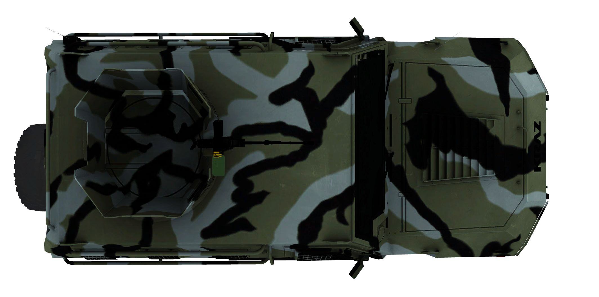

## README

### 模型
- 使用的是副本。
- 从 [Sketchfab](https://sketchfab.com/feed) 下载 `.fbx` 格式模型文件。
- 导入 `Blender4.4.3` 并按照 [Video](https://www.bilibili.com/video/BV1i5qVYhERG/?spm_id_from=333.1387.favlist.content.click&vd_source=ecc24dd03d67b9fec1e5e1e7f0f85646) 进行模型的修改。模型应只保留 `body,wheel1,wheel2,wheel3,wheel4` ，其余部件使用 `command + j` 命令合并到 `body` 即可。
- 模型导出时，如果需要保留原始贴图，需要切换 `试图着色方式` 为 `渲染` 并进行导出，导入到 `UE` 中就会附带贴图。
- 导出 `obj` 格式时，首先在 `blender` 中导入 `audi` 模型, 并调整自己的模型与其轴向一致。导出时，`材质` 需要勾选且 `路径模式` 设置为 `复制`，这样导出的 `obj` 文件会附带贴图，如果在 `load_obj` 的时候报错缺少贴图，手动放入贴图文件。如果没有且这个贴图不重要，随意创建此文件，保证命名相同即可。
- 模型导出时要注意轴向，下图展示了正确轴向，可以使用 `trimesh` 库进行查看。
    ```python
    def show_obj(filename):
        import trimesh
        mesh = trimesh.load(filename)
        mesh.show()
    ```
    

- 只适用于轮式载具，不限 `wheel` 数量。


### 数据集
- 数据集采集时，需要采集 `image,mask,vehicle,camera` 信息。其中，`image,vehicle,camera` 信息保存在 `npz` 格式文件中。
- 创建新的语义标签，导入自定义模型以后，如果直接进行数据的采集，会发现其 `mask` 是全黑的，这说明其被视为 `unlabeled` 类别，可能会影响后续数据集中 `mask` 的制作。可以根据 [Url](https://carla.readthedocs.io/en/latest/tuto_D_create_semantic_tags/) 进行语义标签的创建。
- 根据 [Github](https://github.com/winterwindwang/winterwindwang.github.io/blob/master/_posts/tech/2022-05-05-fca-technical-details-face.md) 生成 `exterior_face.txt` 文件。具体步骤如下：

    1. `File` -> `Import` 导入 `obj` 格式文件。
    2. 在右侧选中 `Editable Mesh`，然后在 `Editable Mesh` 中选中 `Faces`。可以 `command + a` 全选所有面，然后取消选择不需要进行渲染的面。
    3. `Scripting` -> `New script` 输入代码，在代码编辑器中 `Tools` -> `Excute All` 运行代码。
    ```python
    (
    out_name = "D:/faces.txt"
    out_file = createfile out_name

    fSel = $.selectedFaces	
    for face in (fSel) do (
        format "%\n" face.index to:out_file
        )
                        
    close out_file
    )

    ```


### 渲染
- 自行采集到的数据集，会发现渲染时有较大偏移，数据采集过程中存在偏差。因此，需要对相机坐标做一个转换。具体原因有待探索。
    ```python
    # 包围盒
    bbox = vehicle.bounding_box
    carlaTcam[0][0] -= bbox.location.x
    carlaTcam[0][1] -= bbox.location.y
    carlaTcam[0][2] -= bbox.location.z
    ```

### 常见的问题
- `carla` 源码编译中出现的问题过多，可借助搜索引擎解决。
- `Cannot create rpc server for Traffic Manager` 错误的原因是 `rpc` 端口被占用，可以使用 `netstat -tnlp | grep :8000` 命令查询端口占用情况，使用 `kill -9 pid
` 关闭此进程。注意，`8000` 不需要更改。


### 参考
